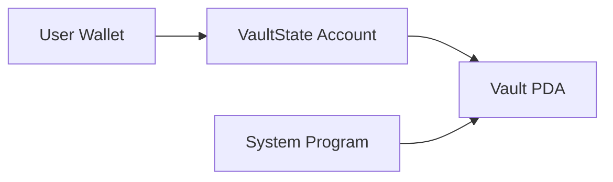

# Solana Vault Program

A secure, Anchor-based vault system for managing SOL deposits on the Solana blockchain. Implements PDA (Program Derived Address) management with strict access controls.

## Features

- **Vault Initialization**: Create unique vault accounts tied to user wallets
- **SOL Deposits**: Securely store funds in PDA-controlled vaults
- **Withdrawals**: Owner-controlled fund retrieval with PDA signatures
- **Account Closure**: Safely close vaults and recover rent exemption
- **State Management**: Track vault configuration through dedicated state accounts

## Technology Stack

- **Anchor 0.31.0**: Solana's secure framework for Solana program development
- **Solana Program Library (SPL)**: System program integration for native transfers
- **Rust**: Memory-safe systems programming language
- **PDAs**: Program Derived Addresses for secure account ownership
- **Cross-Program Invocations (CPI)**: Safe system program interactions

## Installation

### Prerequisites
- Rust 1.65.0+
- Solana CLI 1.16.18+
- Anchor 0.31.0

### Setup
```bash
git clone https://github.com/your-username/solana-vault-program.git
cd solana-vault-program
anchor build

```

## Usage

### Initialize Vault
```typescript
const [vaultStatePDA] = anchor.web3.PublicKey.findProgramAddressSync(
  [Buffer.from("state"), user.publicKey.toBuffer()],
  program.programId
);

await program.methods.initialize()
  .accounts({
    user: user.publicKey,
    vaultState: vaultStatePDA,
    systemProgram: anchor.web3.SystemProgram.programId
  })
  .signers([user])
  .rpc();
```

### Deposit SOL
```typescript
await program.methods.deposit(new anchor.BN(lamports))
  .accounts({
    user: user.publicKey,
    vault: vaultPDA,
    vaultState: vaultStatePDA,
    systemProgram: anchor.web3.SystemProgram.programId
  })
  .signers([user])
  .rpc();
```

### Withdraw SOL
```typescript
await program.methods.withdraw(new anchor.BN(lamports))
  .accounts({
    user: user.publicKey,
    vault: vaultPDA,
    vaultState: vaultStatePDA,
    systemProgram: anchor.web3.SystemProgram.programId
  })
  .signers([user])
  .rpc();
```

### Close Vault
```typescript
await program.methods.close()
  .accounts({
    user: user.publicKey,
    vault: vaultPDA,
    vaultState: vaultStatePDA,
    systemProgram: anchor.web3.SystemProgram.programId
  })
  .signers([user])
  .rpc();
```

## Technical Design

### Account Structure


### Key Components
1. **VaultState Account**
   - Stores security parameters (vault_bump, state_bump)
   - 10 bytes storage (8 byte header + 2x1 byte bumps)
   - Initialized per-user with PDA derivation

2. **Vault PDA**
   - SOL vault address derived from VaultState key
   - Managed exclusively through program instructions
   - Requires PDA signature for fund movements

3. **Security Model**
   - Dual PDA verification (state + vault)
   - Owner-bound account relationships
   - Secure CPI with program-derived signatures

## Security Considerations

### Critical Safeguards
1. **PDA Ownership**
   - Vault accounts owned exclusively by program-derived addresses
   - System program used for native SOL transfers

2. **Signature Validation**
   ```rust
   let seeds = &[
       b"vault",
       self.vault_state.to_account_info().key.as_ref(),
       &[self.vault_state.vault_bump],
   ];
   ```
   - Strict bump verification from stored state
   - Program-controlled signing for withdrawals

3. **Account Closure Protection**
   - Complete fund recovery before state deletion
   - Rent exemption automatic return on closure
   - Prevention of orphaned accounts

4. **Reentrancy Protection**
   - Atomic operations with system program CPI
   - No recursive call possibilities


## License

MIT License - see [LICENSE.md](LICENSE.md) for details

